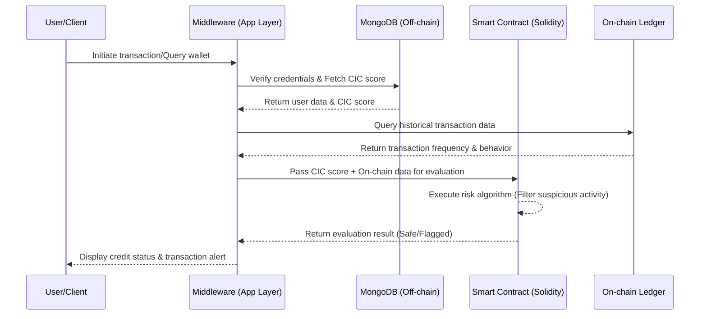

# DeFi Credit Scoring & Transaction Monitoring System

##  Overview
This repository contains an academic proof-of-concept project designed to bridge traditional financial risk assessment with Decentralized Finance (DeFi). The system acts as an intelligent middleware layer that queries, monitors, and analyzes cryptocurrency wallet transactions. 

By integrating traditional Credit Information Center (CIC) scoring models into a Web3 environment, the project successfully identifies and flags suspicious wallet activities through custom Solidity smart contracts. It utilizes a hybrid data architecture to ensure both the privacy of sensitive user credentials and the immutability of transaction records.

##  System Architecture

The project employs a hybrid architecture, balancing off-chain efficiency with on-chain transparency.

###** Architecture Workflow:**
Middleware (Data Retrieval): Acts as the core engine, querying historical transaction behaviors and frequencies of specific wallets from the blockchain network.

Hybrid Database (MongoDB): Securely stores off-chain data, including user login credentials and mapped traditional CIC credit scores, ensuring sensitive PII (Personally Identifiable Information) remains off the public ledger.

Smart Contract Evaluation: The Solidity smart contracts receive data from the middleware to execute custom risk-assessment algorithms. It evaluates the wallet's reliability based on its CIC score and on-chain transaction frequency, actively filtering out suspicious patterns.

On-chain Validation: Leverages the immutable nature of the blockchain to verify real-time transaction states and cross-reference wallet histories.

###** Key Features**
Traditional-to-DeFi Credit Bridging: Pioneers the application of traditional CIC credit scores within a decentralized ecosystem.

Suspicious Activity Filtering: Automated tracking and flagging of irregular transaction frequencies and patterns using smart contract logic.

Hybrid Data Management: Optimized data flow separating public ledger records (on-chain) from private user identities (MongoDB).

High-Performance Middleware: Efficiently routes data between the decentralized ledger, the centralized database, and the evaluating smart contracts.

###** Tech Stack**
Blockchain/Smart Contracts: Solidity, Web3.js / Ethers.js

Database: MongoDB (Off-chain)

Backend/Middleware: Node.js / Python (Specify your backend framework)

Network: (e.g., Ethereum Testnet / BSC Testnet)
